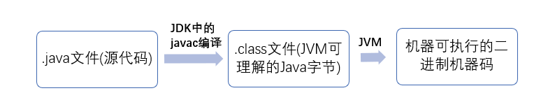

## 基础概念与常识

### JVM vs JDK vs JRE

#### JVM

Java 虚拟机（JVM）是运行 Java 字节码的虚拟机。JVM 有针对不同系统的特定实现（Windows，Linux，macOS），目的是使用相同的字节码，它们都会给出相同的结果。

**什么是字节码?采用字节码的好处是什么?**

> 在 Java 中，JVM 可以理解的代码就叫做`字节码`（即扩展名为 `.class` 的文件），它不面向任何特定的处理器，只面向虚拟机。Java 语言通过字节码的方式，在一定程度上解决了传统解释型语言执行效率低的问题，同时又保留了解释型语言可移植的特点。所以 Java 程序运行时比较高效，而且，由于字节码并不针对一种特定的机器，因此，Java 程序无须重新编译便可在多种不同操作系统的计算机上运行。

**Java 程序从源代码到运行一般有下面 3 步：**



我们需要格外注意的是 .class->机器码 这一步。在这一步 JVM 类加载器首先加载字节码文件，然后通过解释器逐行解释执行，这种方式的执行速度会相对比较慢。而且，有些方法和代码块是经常需要被调用的(也就是所谓的热点代码)，所以后面引进了 JIT 编译器，而 JIT 属于运行时编译。当 JIT 编译器完成第一次编译后，其会将字节码对应的机器码保存下来，下次可以直接使用。而我们知道，机器码的运行效率肯定是高于 Java 解释器的。这也解释了我们为什么经常会说 Java 是编译与解释共存的语言。

> HotSpot 采用了惰性评估(Lazy Evaluation)的做法，根据二八定律，消耗大部分系统资源的只有那一小部分的代码（热点代码），而这也就是 JIT 所需要编译的部分。JVM 会根据代码每次被执行的情况收集信息并相应地做出一些优化，因此执行的次数越多，它的速度就越快。JDK 9 引入了一种新的编译模式 AOT(Ahead of Time Compilation)，它是直接将字节码编译成机器码，这样就避免了 JIT 预热等各方面的开销。JDK 支持分层编译和 AOT 协作使用。但是 ，AOT 编译器的编译质量是肯定比不上 JIT 编译器的。

**总结：**

Java 虚拟机（JVM）是运行 Java 字节码的虚拟机。JVM 有针对不同系统的特定实现（Windows，Linux，macOS），目的是使用相同的字节码，它们都会给出相同的结果。字节码和不同系统的 JVM 实现是 Java 语言“一次编译，随处可以运行”的关键所在。

#### JDK 和 JRE

JDK 是 Java Development Kit 缩写，它是功能齐全的 Java SDK。它拥有 JRE 所拥有的一切，还有编译器（javac）和工具（如 javadoc 和 jdb）。它能够创建和编译程序。

JRE 是 Java 运行时环境。它是运行已编译 Java 程序所需的所有内容的集合，包括 Java 虚拟机（JVM），Java 类库，java 命令和其他的一些基础构件。但是，它不能用于创建新程序。

如果你只是为了运行一下 Java 程序的话，那么你只需要安装 JRE 就可以了。如果你需要进行一些 Java 编程方面的工作，那么你就需要安装 JDK 了。但是，这不是绝对的。有时，即使您不打算在计算机上进行任何 Java 开发，仍然需要安装 JDK。例如，如果要使用 JSP 部署 Web 应用程序，那么从技术上讲，您只是在应用程序服务器中运行 Java 程序。那你为什么需要 JDK 呢？因为应用程序服务器会将 JSP 转换为 Java servlet，并且需要使用 JDK 来编译 servlet。


### Java 和 C++的区别?

我知道很多人没学过 C++，但是面试官就是没事喜欢拿咱们 Java 和 C++ 比呀！没办法！！！就算没学过 C++，也要记下来！

- 都是面向对象的语言，都支持封装、继承和多态
- Java 不提供指针来直接访问内存，程序内存更加安全
- Java 的类是单继承的，C++ 支持多重继承；虽然 Java 的类不可以多继承，但是接口可以多继承。
- Java 有自动内存管理垃圾回收机制(GC)，不需要程序员手动释放无用内存。
- C ++同时支持方法重载和操作符重载，但是 Java 只支持方法重载（操作符重载增加了复杂性，这与 Java 最初的设计思想不符）。
- ......


### Java 泛型了解么？什么是类型擦除？介绍一下常用的通配符？

Java 泛型（generics）是 JDK 5 中引入的一个新特性, 泛型提供了编译时类型安全检测机制，该机制允许程序员在编译时检测到非法的类型。泛型的本质是参数化类型，也就是说所操作的数据类型被指定为一个参数。

Java 的泛型是伪泛型，这是因为 Java 在编译期间，所有的泛型信息都会被擦掉，这也就是通常所说类型擦除 。

```java
List<Integer> list = new ArrayList<>();

list.add(12);
//这里直接添加会报错
list.add("a");
Class<? extends List> clazz = list.getClass();
Method add = clazz.getDeclaredMethod("add", Object.class);
//但是通过反射添加，是可以的
add.invoke(list, "kl");

System.out.println(list);Copy to clipboardErrorCopied
```

泛型一般有三种使用方式:泛型类、泛型接口、泛型方法。

**常用的通配符为： T，E，K，V，？**

- ？ 表示不确定的 java 类型
- T (type) 表示具体的一个 java 类型
- K V (key value) 分别代表 java 键值中的 Key Value
- E (element) 代表 Element


### hashCode()与 equals()

面试官可能会问你：“你重写过 `hashcode` 和 `equals`么，为什么重写 `equals` 时必须重写 `hashCode` 方法？”

**1)hashCode()介绍:**

`hashCode()` 的作用是获取哈希码，也称为散列码；它实际上是返回一个 int 整数。这个哈希码的作用是确定该对象在哈希表中的索引位置。`hashCode()`定义在 JDK 的 `Object` 类中，这就意味着 Java 中的任何类都包含有 `hashCode()` 函数。另外需要注意的是： `Object` 的 hashcode 方法是本地方法，也就是用 c 语言或 c++ 实现的，该方法通常用来将对象的 内存地址 转换为整数之后返回。

```java
public native int hashCode();Copy to clipboardErrorCopied
```

散列表存储的是键值对(key-value)，它的特点是：能根据“键”快速的检索出对应的“值”。这其中就利用到了散列码！（可以快速找到所需要的对象）

**2)为什么要有 hashCode？**

我们以“`HashSet` 如何检查重复”为例子来说明为什么要有 hashCode？

当你把对象加入 `HashSet` 时，`HashSet` 会先计算对象的 hashcode 值来判断对象加入的位置，同时也会与其他已经加入的对象的 hashcode 值作比较，如果没有相符的 hashcode，`HashSet` 会假设对象没有重复出现。但是如果发现有相同 hashcode 值的对象，这时会调用 `equals()` 方法来检查 hashcode 相等的对象是否真的相同。如果两者相同，`HashSet` 就不会让其加入操作成功。如果不同的话，就会重新散列到其他位置。（摘自 《Head First Java》第二版）。这样我们就大大减少了 equals 的次数，相应就大大提高了执行速度。

**3)为什么重写 `equals` 时必须重写 `hashCode` 方法？**

如果两个对象相等，则 hashcode 一定也是相同的。两个对象相等,对两个对象分别调用 equals 方法都返回 true。但是，两个对象有相同的 hashcode 值，它们也不一定是相等的 。**因此，equals 方法被覆盖过，则 `hashCode` 方法也必须被覆盖。**

> `hashCode()`的默认行为是对堆上的对象产生独特值。如果没有重写 `hashCode()`，则该 class 的两个对象无论如何都不会相等（即使这两个对象指向相同的数据）

**4)为什么两个对象有相同的 hashcode 值，它们也不一定是相等的？**

在这里解释一位小伙伴的问题。以下内容摘自《Head Fisrt Java》。

因为 `hashCode()` 所使用的哈希算法也许刚好会让多个对象传回相同的哈希值。越糟糕的哈希算法越容易碰撞，但这也与数据值域分布的特性有关（所谓碰撞也就是指的是不同的对象得到相同的 `hashCode`。

我们刚刚也提到了 `HashSet`,如果 `HashSet` 在对比的时候，同样的 hashcode 有多个对象，它会使用 `equals()` 来判断是否真的相同。也就是说 `hashcode` 只是用来缩小查找成本。

**记：**两个对象的hashcode相等，其也不一定就是相等，因为因hash算法原因，不同的对象也可能拥有相同的hashcode，但是equals相等，其一定相等。


### 基本数据类型

java一共有8种数据类型

1. 6种数字类型 `byte, int, short, long, float, double `
2. 1种字符类型：`char`
3. 1种布尔类型 `boolean`


**对应的包装类型：**

1. 6种数字类型包装 `Byte, Integer, Short, Long, Float, Double `
2. 1种字符类型包装：` Character`
3. 1种布尔类型包装`Boolean`

- 包装类型不赋值就是`null`，基本类型有默认值且不是`null`

- Java 基本类型的包装类的大部分都实现了常量池技术。`Byte`,`Short`,`Integer`,`Long` 这 4 种包装类默认创建了数值 **[-128，127]** 的相应类型的缓存数据，`Character` 创建了数值在[0,127]范围的缓存数据，`Boolean` 直接返回 `True` Or `False`。


### **在一个静态方法内调用一个非静态成员为什么是非法的？**

静态方法是属于类的，而非静态成员是属于对象的，在类还未被实例化的时候，静态方法就已经存在了，但是内存中非静态成员还未存在。


### String StringBuffer 和 StringBuilder 的区别是什么? String 为什么是不可变的?

String是不可变的，源码中用`private final char value[]`来保存字符串，所以String是不可变的。

StringBuffer和StringBuilder也是用字符数组来保存字符串，但是StringBuffer是线程安全的，StringBuilder不是线程安全的。

**适用场景：**

1. 操作少量的数据: 适用 `String`
2. 单线程操作字符串缓冲区下操作大量数据: 适用 `StringBuilder`
3. 多线程操作字符串缓冲区下操作大量数据: 适用 `StringBuffer`


### Java 中 IO 流分为几种?

- 按照流的流向分，可以分为输入流和输出流；
- 按照操作单元划分，可以划分为字节流和字符流；
- 按照流的角色划分为节点流和处理流。


### 反射

反射之所以被称为框架的灵魂，主要是因为它赋予了我们在运行时分析类以及执行类中方法的能力。通过反射你可以获取任意一个类的所有属性和方法，你还可以调用这些方法和属性。

#### 谈谈反射机制的优缺点

**优点** ： 可以让咱们的代码更加灵活、为各种框架提供开箱即用的功能提供了便利

**缺点** ：让我们在运行时有了分析操作类的能力，这同样也增加了安全问题。比如可以无视泛型参数的安全检查（泛型参数的安全检查发生在编译时）。另外，反射的性能也要稍差点，不过，对于框架来说实际是影响不大的。

### 获取 Class 对象的四种方式

如果我们动态获取到这些信息，我们需要依靠 Class 对象。Class 类对象将一个类的方法、变量等信息告诉运行的程序。Java 提供了四种方式获取 Class 对象:

**1.知道具体类的情况下可以使用：**

```java
Class alunbarClass = TargetObject.class;Copy to clipboardErrorCopied
```

但是我们一般是不知道具体类的，基本都是通过遍历包下面的类来获取 Class 对象，通过此方式获取 Class 对象不会进行初始化

**2.通过 `Class.forName()`传入类的路径获取：**

```java
Class alunbarClass1 = Class.forName("cn.javaguide.TargetObject");Copy to clipboardErrorCopied
```

**3.通过对象实例`instance.getClass()`获取：**

```java
TargetObject o = new TargetObject();
Class alunbarClass2 = o.getClass();Copy to clipboardErrorCopied
```

**4.通过类加载器`xxxClassLoader.loadClass()`传入类路径获取:**

```java
Class clazz = ClassLoader.loadClass("cn.javaguide.TargetObject");Copy to clipboardErrorCopied
```

通过类加载器获取 Class 对象不会进行初始化，意味着不进行包括初始化等一些列步骤，静态块和静态对象不会得到执行

**反射示例：**

```java
User user = new User();
user.setUserId("100");
System.out.println(user.getUserId()); //100
Method setUserId = user.getClass().getDeclaredMethod("setUserId", String.class);
setUserId.invoke(user,"156");
System.out.println(user.getUserId());//156
```

## IO

IO也就是输入输出，常见的输入设备：键盘，鼠标，常见的输出设备：打印机，显示器。

所谓的输入，也就是将外界的元素输入到内存或者硬盘中，同理输出就是将内存硬盘的数据输出出来的设备，比如打印机就讲数据显示出来。

IO有5种模型：

`同步阻塞IO、同步非阻塞IO 、IO多路复用 、信号驱动IO 、异步IO`

### Java中常见的三种IO

- BIO (Blocking IO）同步阻塞IO

  发起read调用后，会一直堵塞。

- NIO (Non-blocking IO) 同步非阻塞IO  

  1. 发起read调用后，不会堵塞，但是将内核空间数据拷贝到用户空间这一过程是阻塞的。
  2. 采用不断的轮训可以避免一直等待，但是大量的轮询也会消耗大量的系统资源。

- AIO (AIO (Asynchronous I/O)) 异步IO

  异步 IO 是基于事件和回调机制实现的，也就是应用操作之后会直接返回，不会堵塞在那里，当后台处理完成，操作系统会通知相应的线程进行后续的操作。


原图链接：https://images.xiaozhuanlan.com/photo/2020/33b193457c928ae02217480f994814b6.png

## 集合


### ArrayList和LinkedList

- 两者都不是线程安全的。
- ArrayList底层使用的是对象数组 `Object [ ]`,而LinkedList使用的是双向链表（1.6之前是使用的双向循环链表）
- 内存空间占用，LinkedList要大一些，因为是链表，每一个节点都要存放前驱和后驱以及数据。而ArrayList空间主要浪费在List列表结尾会预留一定的容量空间。
- **是否支持快速随机访问：** `LinkedList` 不支持高效的随机元素访问，而 `ArrayList` 支持。快速随机访问就是通过元素的序号快速获取元素对象(对应于`get(int index)`方法)。

### Map

#### HashMap 和 Hashtable 的区别

1. **线程是否安全：** `HashMap` 是非线程安全的，`HashTable` 是线程安全的,因为 `HashTable` 内部的方法基本都经过`synchronized` 修饰。（如果你要保证线程安全的话就使用 `ConcurrentHashMap` 吧！）；
2. **效率：** 因为线程安全的问题，`HashMap` 要比 `HashTable` 效率高一点。另外，`HashTable` 基本被淘汰，不要在代码中使用它；
3. **对 Null key 和 Null value 的支持：** `HashMap` 可以存储 null 的 key 和 value，但 null 作为键只能有一个，null 作为值可以有多个；HashTable 不允许有 null 键和 null 值，否则会抛出 `Nu-llPointerException`。
4. **初始容量大小和每次扩充容量大小的不同 ：** ① 创建时如果不指定容量初始值，`Hashtable` 默认的初始大小为 11，之后每次扩充，容量变为原来的 2n+1。`HashMap` 默认的初始化大小为 16。之后每次扩充，容量变为原来的 2 倍。② 创建时如果给定了容量初始值，那么 Hashtable 会直接使用你给定的大小，而 `HashMap` 会将其扩充为 2 的幂次方大小（`HashMap` 中的`tableSizeFor()`方法保证，下面给出了源代码）。也就是说 `HashMap` 总是使用 2 的幂作为哈希表的大小,后面会介绍到为什么是 2 的幂次方。
5. **底层数据结构：** JDK1.8 以后的 `HashMap` 在解决哈希冲突时有了较大的变化，当链表长度大于阈值（默认为 8）（将链表转换成红黑树前会判断，如果当前数组的长度小于 64，那么会选择先进行数组扩容，而不是转换为红黑树）时，将链表转化为红黑树，以减少搜索时间。Hashtable 没有这样的机制。

#### HashMap 和 TreeMap 的区别

`TreeMap` 和`HashMap` 都继承自`AbstractMap` ，但是需要注意的是`TreeMap`它还实现了`NavigableMap`接口和`SortedMap` 接口。

- 实现 `NavigableMap` 接口让 `TreeMap` 有了对集合内元素的搜索的能力。

- 实现`SortMap`接口让 `TreeMap` 有了对集合中的元素根据键排序的能力。默认是按 key 的升序排序，不过我们也可以指定排序的比较器。

### HashSet 如何检查重复

以下内容摘自我的 Java 启蒙书《Head fist java》第二版：

当你把对象加入`HashSet`时，`HashSet` 会先计算对象的`hashcode`值来判断对象加入的位置，同时也会与其他加入的对象的 `hashcode` 值作比较，如果没有相符的 `hashcode`，`HashSet` 会假设对象没有重复出现。但是如果发现有相同 `hashcode` 值的对象，这时会调用`equals()`方法来检查 `hashcode` 相等的对象是否真的相同。如果两者相同，`HashSet` 就不会让加入操作成功。

**`hashCode()`与 `equals()` 的相关规定：**

1. 如果两个对象相等，则 `hashcode` 一定也是相同的
2. 两个对象相等,对两个 `equals()` 方法返回 true
3. 两个对象有相同的 `hashcode` 值，它们也不一定是相等的
4. 综上，`equals()` 方法被覆盖过，则 `hashCode()` 方法也必须被覆盖
5. `hashCode()`的默认行为是对堆上的对象产生独特值。如果没有重写 `hashCode()`，则该 class 的两个对象无论如何都不会相等（即使这两个对象指向相同的数据）。

**==   与  equals   的区别**

对于基本类型来说，== 比较的是值是否相等；

对于引用类型来说，== 比较的是两个引用是否指向同一个对象地址（两者在内存中存放的地址（堆内存地址）是否指向同一个地方）；

对于引用类型（包括包装类型）来说，equals 如果没有被重写，对比它们的地址是否相等；如果 equals()方法被重写（例如 String），则比较的是地址里的内容。


## JDk1.8的新特性

